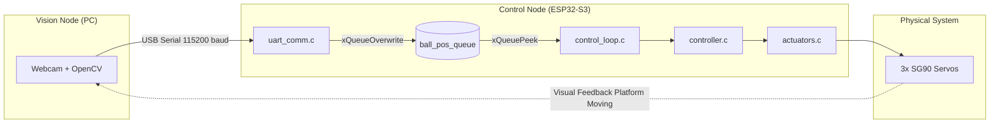
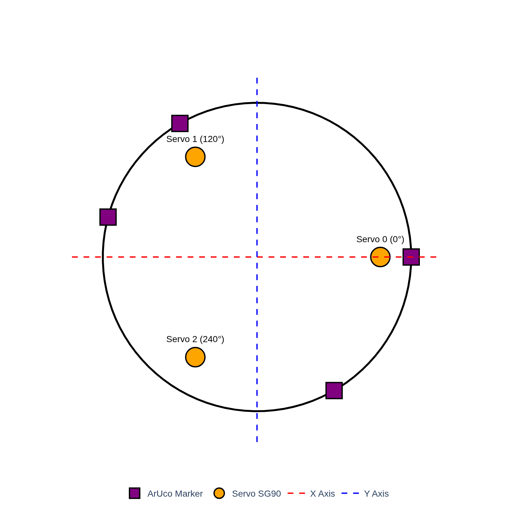
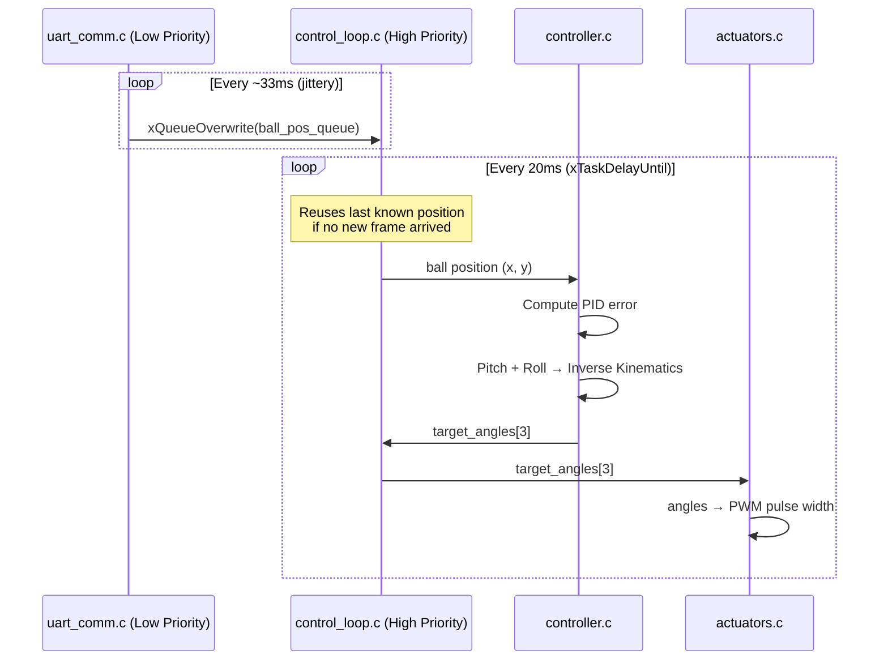
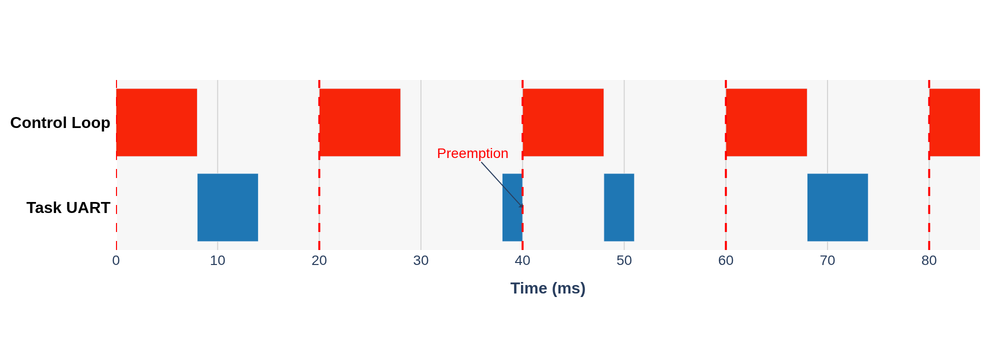
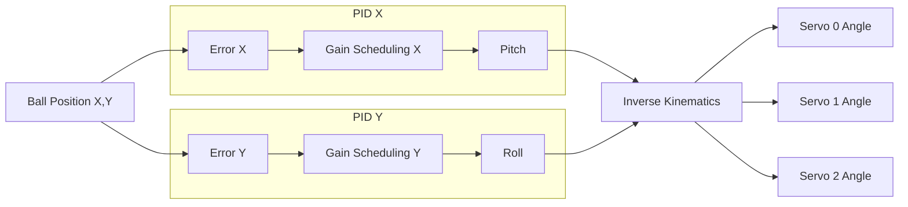
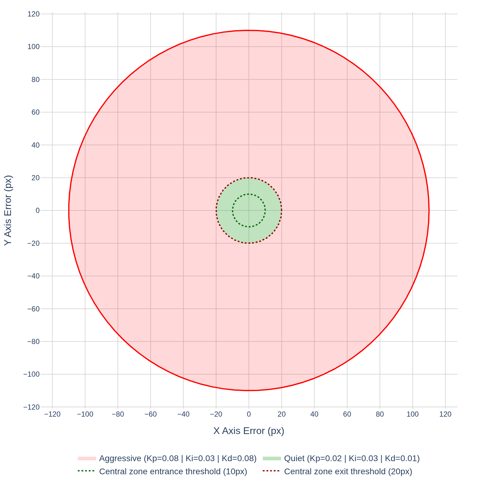

# 3-DOF Stewart Platform

A real-time ball balancing system built on a 3-DOF Stewart platform.
A camera tracks the ball position at 30fps, sends coordinates to an ESP32-S3
via UART, and a PID controller adjusts three SG90 servos to keep the ball centered.

---

## System Architecture



---

## Vision Node

The vision node runs on the host PC as a single Python script: `ball_tracker.py`.

**Platform detection** uses 4 ArUco markers placed on the platform edge.
Three markers are sufficient to compute the circumference and center —
the fourth provides redundancy in case the ball occludes one marker.

<div align="center">
  
</div>

**Ball detection** uses HSV color filtering. The script exposes an interactive
GUI with HSV threshold sliders for real-time recalibration under changing
lighting conditions, which would break a naive RGB-based filter.

The GUI also provides two additional tools:
- **Servo calibration:** manually send `0x02` calibration commands to any
  of the three servos by selecting the servo ID and target angle.
- **Camera calibration:** adjust and persist camera-specific parameters
  directly from the interface without editing the source.

Detected ball coordinates are packed into an 11-byte binary frame and sent
over serial at approximately 30 Hz.

---

## Communication Protocol (UART)

Fixed-length binary frames.

| Field    | Header | Command | Data 1   | Data 2       | CRC     |
|----------|--------|---------|----------|--------------|---------|
| Size     | 1 B    | 1 B     | 4 B      | 4 B          | 1 B     |
| **Total: 11 Bytes** |

**Possible payloads:**

| Command       | Code   | Data 1        | Data 2         |
|---------------|--------|---------------|----------------|
| Ball Tracking | `0x01` | X (pixel)     | Y (pixel)      |
| Servo Calib.  | `0x02` | Servo ID [0-2]| Angle [0-180°] |

Integrity is guaranteed by an XOR checksum on the full frame.

---

## Control Node (ESP32-S3)

### Task Architecture

Two FreeRTOS tasks with different priorities share a single-element queue.


  

The control loop runs at a strict **50 Hz** using `xTaskDelayUntil`, making
it fully deterministic regardless of UART jitter. If the camera drops a frame,
the controller reuses the last valid position rather than blocking or resetting.

The UART task runs at a lower priority and gets preempted whenever the
control loop deadline fires.

<div align="center">
  
</div>

---

### Module Descriptions

#### `main.c`
Entry point. Initializes the UART driver and actuator hardware, then spawns
the two FreeRTOS tasks (`uart_rx_task` and `control_loop_task`) before handing
control to the scheduler.

#### `uart_comm.c`
Receives and parses incoming UART frames. Wakes up on each new packet:
- `0x01` (Tracking): pushes ball coordinates to `ball_pos_queue` via `xQueueOverwrite`.
- `0x02` (Calibration): forwards `servo_id` and `target_angle` directly to `actuators.c`, bypassing the PID.

#### `control_loop.c`
The main real-time task. Every 20ms:
1. Reads `ball_pos_queue` with `xQueuePeek` (non-destructive).
2. Passes position to `controller.c`, receives three target angles.
3. Forwards target angles to `actuators.c`.

#### `controller.c`
Contains PID state and gain scheduling logic.



Inverse kinematics maps picth and roll to individual servo angles:

```
target_angle = gain * (cos(alpha) * pitch + sin(alpha) * roll) + neutral_angle
```

where `alpha` is the angular position of each servo arm (0°, 120°, 240°).

**Gain Scheduling:** The PID operates in two modes depending on ball position:

| Mode         | Condition                                              |
|--------------|--------------------------------------------------------|
| **Quiet**    | Ball inside central zone AND velocity below threshold  |
| **Aggressive**| Ball outside central zone OR velocity above threshold |

Hysteresis prevents chattering at the boundary: the system switches to
`quiet` only when error drops below **10px**, and switches back to  `aggressive`
only when error exceeds **20px**.

<div align="center">
  
</div>


#### `actuators.c`
Receives the three target angles (in degrees, relative to neutral).
Converts each angle to the corresponding PWM pulse width and writes
the signal to the respective servo GPIO pin.
